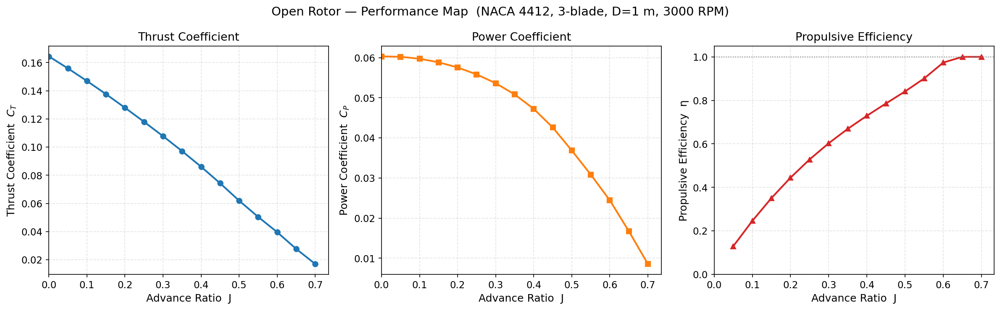
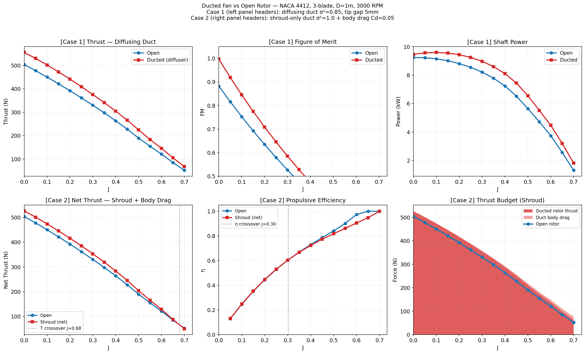
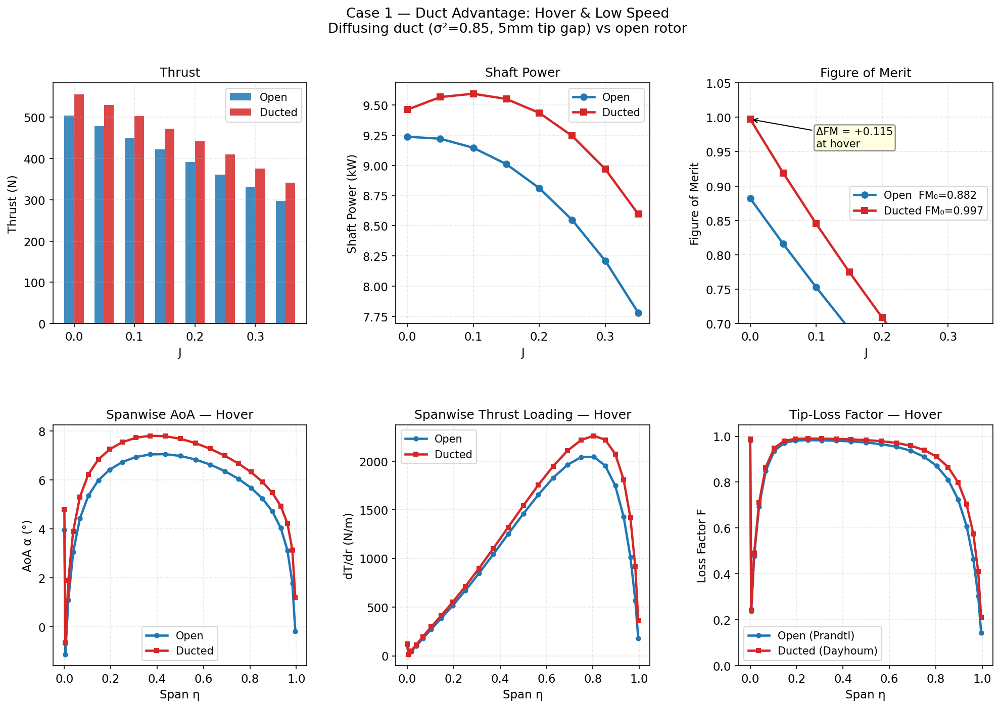
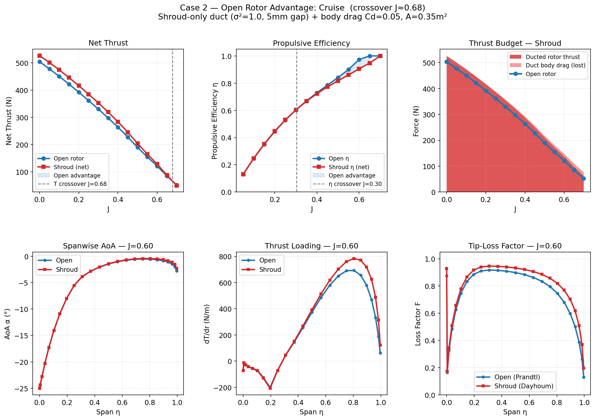
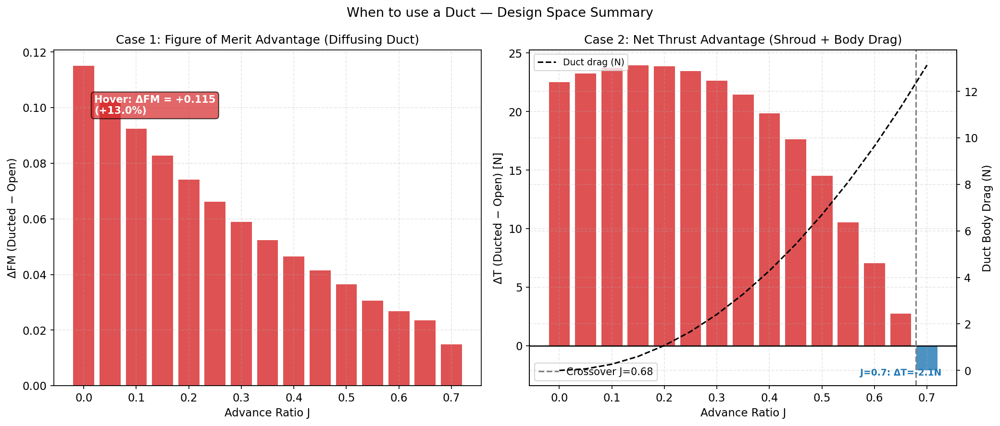

# DuctedFanLib

A Python library for parametric design, BEMT aerodynamic analysis, and parametric studies of ducted fans and open rotors.

---

## Performance at a glance

**Open rotor — CT, CP, and efficiency vs advance ratio (NACA 4412, 3-blade, D=1 m, 3000 RPM)**



**Ducted fan vs open rotor — when each configuration wins**



| Metric | Case | Winner |
|--------|------|--------|
| Figure of Merit at hover | σ²=0.85 diffusing duct | **Ducted** (+11.5%, FM 0.882→0.997) |
| Net thrust at J > 0.68 | Shroud + body drag | **Open rotor** |
| Propulsive efficiency at J > 0.30 | Shroud + body drag | **Open rotor** |

---

## Features

**Parametric geometry**
- Variable chord, twist, and airfoil along the span via `LinearDistribution`, `BezierCurve`, `SplineCurve`
- Full `DuctedFan` assembly with geometric validation (rotor fits inside duct)

**Airfoil analysis**
- NACA 4-digit generation and arbitrary coordinate import
- On-the-fly polar computation via `neuralfoil` or `AeroSandbox` XFoil wrapper
- Viterna–Corrigan post-stall extrapolation
- Polar table loading for validation workflows

**BEMT solvers**
- `calculate_bemt_performance_axial` — open rotor, all V (hover to cruise), universal velocity-form phi-iteration
- `calculate_bemt_performance_ducted` — ducted fan, Dayhoum elliptic-integral tip-gap model, σd² correction
- Prandtl hub + tip loss factors (both solvers)
- Convergence-checked, non-degenerate at hover (V=0)

**Parametric studies**
- `ParametricStudy.sweep_advance_ratio` — J-sweep at fixed RPM
- `ParametricStudy.sweep_design_parameter` — sensitivity to any design variable (e.g. collective pitch)
- `export_results(path, fmt)` — CSV or JSON output
- `summary_table()` — formatted overview DataFrame
- Built-in plots: performance curves, spanwise distributions, streamtube, sensitivity

---

## Installation

```bash
git clone https://github.com/AhmedMoustafaa/ductedfanlib
cd ductedfanlib
python -m venv venv && source venv/bin/activate   # optional but recommended
pip install -e .[dev]
```

**Dependencies** (installed automatically): `numpy`, `scipy`, `matplotlib`, `pandas`, `neuralfoil`, `aerosandbox`

---

## Quick start

### Open rotor — J sweep

```python
import numpy as np
from ductedfanlib import (
    generate_naca4_coordinates, LinearDistribution,
    Blade, Rotor, Duct, DuctedFan, BezierCurve,
    ParametricStudy,
)

# Airfoil
af = generate_naca4_coordinates("4412", default_analysis_method="neuralfoil")
af.characterize_stall_properties(Re=500_000)

# Blade + rotor
blade  = Blade(airfoil_definition=af,
               chord_profile=LinearDistribution(0.10, 0.06),
               twist_profile=LinearDistribution(25.0, 12.0))
rotor  = Rotor(num_blades=3, tip_radius=0.5, hub_radius=0.08, blade_definition=blade)

# DuctedFan wrapper (tip_clearance=0 → open rotor)
duct   = Duct(profile_curve=BezierCurve([[0, 0.6], [0.5, 0.6], [1.0, 0.6]]))
design = DuctedFan(rotor=rotor, duct=duct, tip_clearance=0.0)

# Parametric study
study = ParametricStudy(design)
df    = study.sweep_advance_ratio(rpm=3000, j_range=np.linspace(0.0, 0.7, 15))
print(study.summary_table())

study.plot_performance_curves()
study.plot_spanwise_distributions(j_values=[0.0, 0.3, 0.6])
study.export_results("results.csv")
```

### Single-point analysis

```python
from ductedfanlib import run_bemt_analysis, OperatingConditions

op_hover   = OperatingConditions(axial_velocity_ms=0.0,  rpm=3000)
op_cruise  = OperatingConditions(axial_velocity_ms=15.0, rpm=3000)

res_hover  = run_bemt_analysis(design, op_hover)
res_cruise = run_bemt_analysis(design, op_cruise)

print(f"Hover:  T={res_hover['total_thrust_N']:.1f} N   FM={res_hover['figure_of_merit']:.3f}")
print(f"Cruise: T={res_cruise['total_thrust_N']:.1f} N   η={res_cruise['propulsive_efficiency']:.3f}")
```

### Ducted fan

```python
from ductedfanlib.analysis.bemt import calculate_bemt_performance_ducted
from ductedfanlib import get_rotor_bemt_stations

stations = get_rotor_bemt_stations(rotor, num_stations=25)

res = calculate_bemt_performance_ducted(
    stations,
    V_axial_ms          = 0.0,      # hover
    omega_rads          = 3000 * 2 * 3.14159 / 60,
    num_blades          = 3,
    rho_kgm3            = 1.225,
    mu_Pas              = 1.81e-5,
    root_radius_m       = 0.08,
    tip_radius_m        = 0.5,
    tip_gap_clearance_m = 0.005,    # 5 mm tip gap
    sigma_d_sq          = 0.85,     # diffusing duct
)
print(f"Ducted hover: T={res['total_thrust_N']:.1f} N   FM={res['figure_of_merit']:.3f}")
```

### Collective pitch sensitivity

```python
df_sens = study.sweep_design_parameter(
    parameter_path="rotor.collective_pitch_deg",
    sweep_range=[-8, -4, 0, 4, 8, 12],
    op_conditions=OperatingConditions(axial_velocity_ms=0.0, rpm=3000),
)
study.plot_sensitivity("rotor.collective_pitch_deg", metrics=["thrust_N", "FM"])
```

---

## Ducted fan vs open rotor

### Case 1 — Hover: duct wins

A bell-inlet diffusing duct (σd²=0.85) seals the tip gap and generates inlet suction, raising FM from 0.882 to 0.997 (+11.5%) with +10.3% more thrust at the same shaft power.



### Case 2 — Cruise: open rotor wins

A shroud-only duct (σd²=1.0) with realistic body drag (Cd=0.05, A=0.35 m²) loses its efficiency advantage above J≈0.30 and its thrust advantage above J≈0.68.



### Design space summary



**Rule of thumb:** use a duct when your mission spends significant time at J < 0.3 (hover, VTOL, low-speed surveillance). Use an open rotor for missions above J ≈ 0.4.

---

## Project structure

```
ductedfanlib/
├── pyproject.toml                  # build config and dependencies
├── requirements.txt                # pinned runtime deps
├── README.md
├── LICENSE
├── docs/
│   └── figures/                   # README figures
├── src/
│   └── ductedfanlib/
│       ├── __init__.py             # public API — all 20 exports
│       ├── study.py                # ParametricStudy + plots + export
│       ├── analysis/
│       │   ├── __init__.py
│       │   ├── bemt2.py            # open-rotor BEMT (all V incl. hover)
│       │   ├── bemt.py             # ducted-fan BEMT (Dayhoum + σd²)
│       │   ├── adt.py              # actuator disk theory (ideal)
│       │   └── manager.py          # run_bemt_analysis() convenience wrapper
│       ├── core/
│       │   ├── __init__.py
│       │   ├── OperatingConditions.py
│       │   ├── blade.py
│       │   ├── rotor.py
│       │   ├── duct.py
│       │   └── design.py           # DuctedFan assembly
│       ├── geometry/
│       │   ├── __init__.py
│       │   ├── airfoils.py
│       │   ├── curves.py
│       │   ├── meshing.py
│       │   └── profiles.py
│       ├── optimization/
│       │   └── __init__.py         # placeholder — not yet implemented
│       └── utils/
│           ├── __init__.py
│           └── constants.py
└── tests/
    ├── ag10.dat                    # reference airfoil data
    ├── test_airfoil.py
    ├── test_bemt_open.py           # open-rotor BEMT tests (22 checks)
    ├── test_bemt_extended.py       # extended parametric tests (39 checks)
    ├── test_fixes.py               # integration tests for all bug fixes (52 checks)
    ├── test_profiles.py
    └── test_rotor.py
```

---

## Running the tests

```bash
pytest tests/ -v
```

---

## Known limitations / roadmap

- `optimization/` package is a placeholder — no optimizer implemented yet
- Duct body drag must be applied manually (not built into `ParametricStudy` yet)
- No 3-D correction for blade sweep or dihedral
- No unsteady or installation effects
- XFoil path requires `aerosandbox` with a working Fortran compiler

---

## Citing

If you use DuctedFanLib in research, please cite the Dayhoum et al. tip-gap model:

> Dayhoum, A. et al. (2023). *Blade Element Momentum Theory for Ducted Fans with Elliptic Integral Tip-Gap Loss Model.* [Journal TBD]
